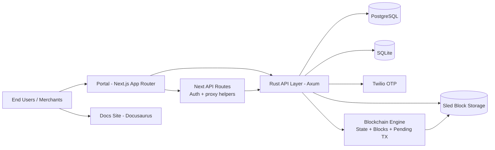
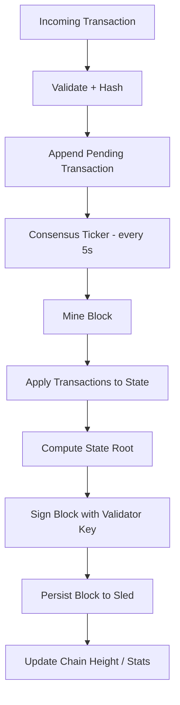
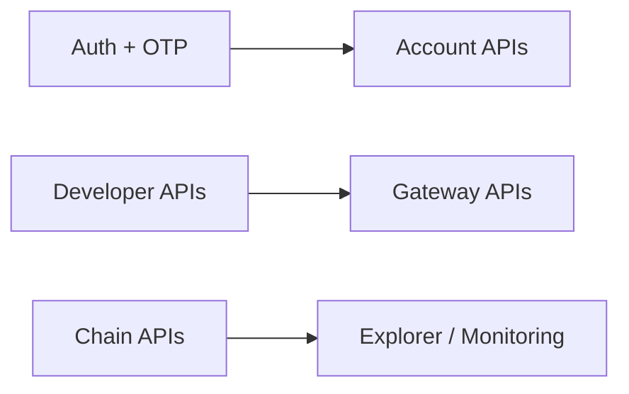
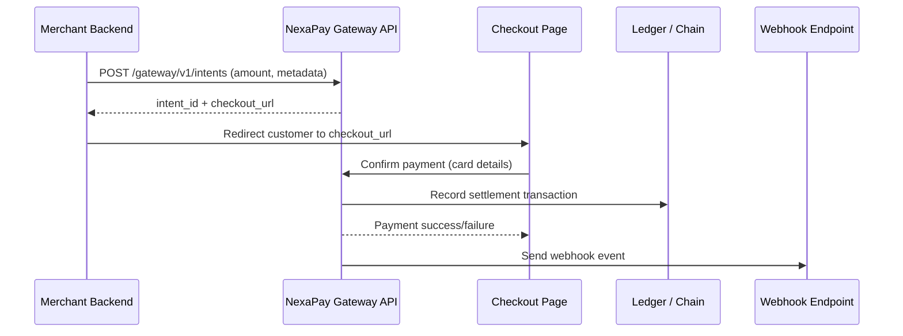
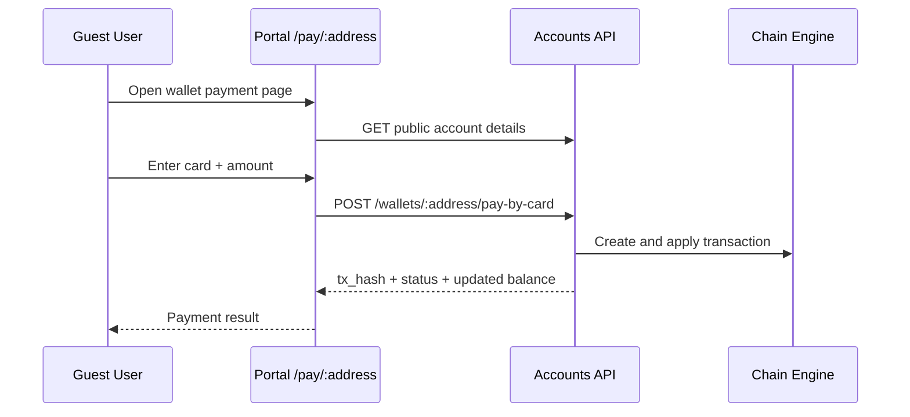

# NexaPay

NexaPay is a full-stack fintech platform that combines:

- A custom Rust blockchain engine for account state and transaction history
- A developer and customer API layer for wallets, accounts, and payment gateway workflows
- A Next.js web portal for end users and developers (e-wallet + checkout)
- A docs-site (Docusaurus) for API and platform documentation

The platform supports user onboarding, account and card management, wallet transfers, merchant payment intents, refunds, payouts, and webhook delivery—positioned as a Tunisia-focused payments and developer API layer (similar in spirit to Stripe-style acquiring and checkout, adapted for local rails).

## Live Website

The NexaPay website is available online.

- Main app: https://nexapay.space

---

## 1) System Architecture



### Runtime components

- Portal on port 3000 in container (published as 3001 in current compose)
- Blockchain/API node on port 8080 in container (published as 8088 in current compose)
- PostgreSQL for transactional business data
- SQLite + Sled used by the chain engine and local node persistence

---

## 2) Blockchain Engine Architecture

The engine is implemented in Rust under blockchain/src and is centered around a Blockchain struct with:

- blocks: immutable block history
- accounts: in-memory account state map
- pending_transactions: mempool-like queue
- storage: persistent block store (Sled)



### Core modules

- blockchain/src/chain.rs: chain state, mining, block validation, tx application
- blockchain/src/consensus.rs: periodic block production ticker
- blockchain/src/block.rs: block and transaction domain model
- blockchain/src/storage.rs: persistent block IO on top of Sled
- blockchain/src/crypto.rs: hashing and signature helpers

### Transaction types currently modeled

- Transfer
- AccountCreate
- LoanDisburse
- LoanRepay
- BankJoin
- DevRegister

---

## 3) API Layer and Business Domains

The Axum router exposes grouped capabilities:

- Auth: register, password login, OTP request/verify
- Accounts: details, public profile, search, transactions, wallet transfer
- Developer portal: register, login, merchant registration, key rotation, usage overview
- Developer: key management and docs snippets
- Payment Gateway: merchant onboarding, intents, confirm, refunds, payouts, webhooks
- Chain Observability: chain stats, blocks, transaction lookup



---

## 4) Online Payment Flows

NexaPay supports two main online payment patterns:

- Merchant hosted checkout via Payment Intents
- Direct wallet funding/payment by card for a target wallet

### 4.1 Merchant payment intent lifecycle



### 4.2 Wallet payment by card (guest flow)



---

## 5) Technology Stack

### Backend / Node

- Rust 2021
- Axum (HTTP API)
- Tokio (async runtime)
- SQLx + PostgreSQL (primary relational data)
- Rusqlite (local state)
- Sled (block persistence)
- JWT (jwt-simple)
- AES-GCM (sensitive field encryption)
- Ed25519 signatures
- Tower HTTP (CORS, tracing)

### Frontend

- Next.js 14 (App Router)
- React 18
- TypeScript
- Tailwind CSS
- Axios
- jsPDF (contract download as PDF)

### Documentation

- Docusaurus 3

### Infrastructure

- Docker + Docker Compose
- Nginx reverse proxy (recommended for production)
- Azure VPS deployment target

---

## 6) Repository Layout

```text
blockchain/   Rust node, API modules, chain engine, migrations
portal/       Next.js web app (customer wallet, developer portal, checkout)
docs-site/    Docusaurus documentation site
docs/         Additional markdown docs
scripts/      Demo and operational helper scripts
```

---

## 7) Local Run (Current Compose)

Prerequisites:

- Docker + Docker Compose plugin

Start services:

```bash
docker compose up -d --build
```

Current published ports (from compose):

- Portal: http://localhost:3001
- Backend API: https://backend.nexapay.space
- PostgreSQL: localhost:5433

Stop services:

```bash
docker compose down
```

---

## 8) Production Notes (Judge Demo)

For public deployment on nexapay.space:

- Set portal NEXT_PUBLIC_API_URL to https://nexapay.space/backend
- Put backend behind Nginx location /backend/
- Keep Next.js frontend at /
- Enable TLS with Certbot
- Replace all default secrets before production

---

## 9) Key Platform Highlights

- Wallet, developer, and gateway APIs in one node
- Signed, append-only block persistence with periodic consensus ticks
- OTP-based user auth with optional Twilio integration
- Merchant-grade payment intent lifecycle with refund, payout, and webhook support

---

## 10) License

No license file is currently defined in this repository. Add one before public distribution.
